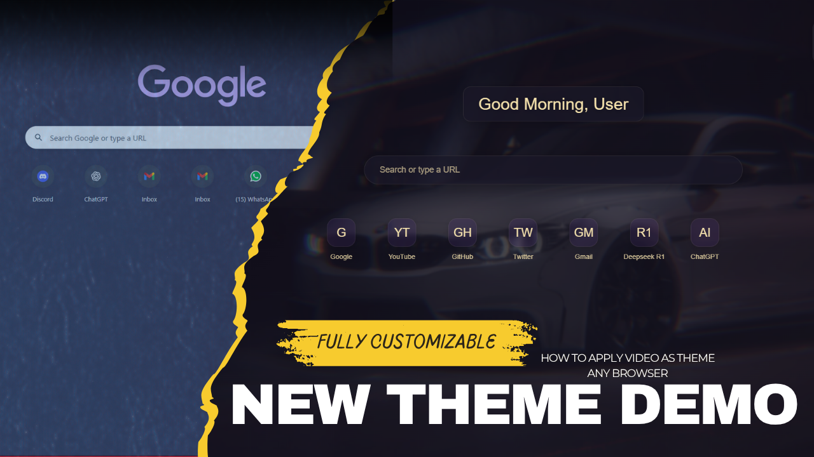

<h1 align="center">🌌 NovaTab – Custom New Tab Extension</h1>

<p align="center">
  A beautifully crafted new tab page with video background, time, weather, search, and customizable links.
</p>

<hr>

## 🚀 Features

- 🎥 Full-screen video backgrounds (customizable)
- 🌗 Light/Dark mode toggle
- 📆 Live time & date display
- 🌤️ Weather widget (static example, needs API for real data)
- 🧠 Personalized greeting
- 🔍 Search bar (placeholder)
- 🔗 Quick-access links
- ⚙️ Settings panel for appearance and background

## 📁 Folder Structure

```
nova-tab/
├── index.html         # Main HTML structure and inline styles
├── manifest.json      # Chrome extension config (v3)
├── script.js          # JavaScript file (placeholder for now)
├── icon.png           # Extension icon
└── videos/            # Video backgrounds (3.mp4, 1.mp4, etc.)
```

## 🛠️ Setup Instructions

1. Open **Google Chrome**.
2. Go to `chrome://extensions/`.
3. Enable **Developer Mode** (top right).
4. Click **Load unpacked**.
5. Select the folder containing these files.

Now, every new tab will open with your custom NovaTab interface.

## 🧩 Manifest Overview

```json
{
  "manifest_version": 3,
  "name": "Custom New Tab",
  "version": "1.0",
  "description": "Replaces the default New Tab page with a custom one.",
  "chrome_url_overrides": {
    "newtab": "index.html"
  },
  "permissions": [],
  "icons": {
    "128": "icon.png"
  }
}
```

## 🔮 Future Enhancements

- Live weather via OpenWeatherMap API
- Search engine integration
- Save user preferences in localStorage

## 📸 Demo Video

[](https://www.youtube.com/watch?v=7U22qgfeONY)


---

## 📜 License

MIT License. You are free to use, modify, and distribute.

---

<p align="center">
  Made with ❤️ for creative minds.
</p>
